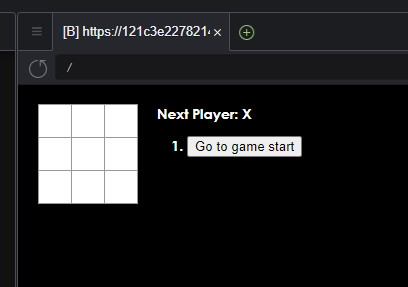
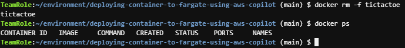

# Deploying a container to AWS Fargate using AWS Copilot

## Step One: Access your account and setup

Open up the AWS Event Engine portal: [https://dashboard.eventengine.run/](https://dashboard.eventengine.run/)


You need to enter the hash that you were provided. This will open up the
Event Engine dashboard. Click on the "AWS Console" button:


Then click on "Open AWS Console".

You will be logged in to the AWS Console of a temporary AWS account that you
can use for the duration of this workshop:


In the search bar at the top type "Cloud9" and click on the "Cloud9" service
when it appears. This will open up the service console for accessing
a cloud development environment. You will see a preprepared development
environment that you can use:


Click on the "Open IDE" button to access your development environment. You may see an
interstitial screen similar to this one for a minute or two:


This workshop will be using an automatically created IAM role that is attached to the Cloud9 development environment, rather than the default Cloud9 temporary credentials.

Now the development environment is ready to go, so we just need to open up a terminal for running commands.

<details>
  <summary>Press the green plus button and select "New Terminal":</summary>

  
</details>

In the terminal you can now run the command to install the latest version of AWS Copilot, and verify that it runs:

```sh
curl -Lo copilot https://github.com/aws/copilot-cli/releases/latest/download/copilot-linux
chmod +x copilot
sudo mv copilot /usr/local/bin/copilot
copilot --help

```

Next let's run a quick script to customize the AWS config inside of the development environment:

```sh
# Install prerequisites
sudo yum install -y jq

# Setting environment variables required to communicate with AWS API's via the cli tools
echo "export AWS_DEFAULT_REGION=$(curl -s 169.254.169.254/latest/dynamic/instance-identity/document | jq -r .region)" >> ~/.bashrc
source ~/.bashrc

mkdir -p ~/.aws

cat << EOF > ~/.aws/config
[default]
region = ${AWS_DEFAULT_REGION}
output = json
role_arn = $(aws iam get-role --role-name test-c9-template-Admin-Access | jq -r .Role.Arn)
credential_source = Ec2InstanceMetadata
EOF

```

Last you should clone this repo inside of the environment in order to pull in the code that will be used:

```sh
git clone https://github.com/bradwatsonaws/deploying-container-to-fargate-using-aws-copilot.git

```


## Step Two: Meet the sample application

In the Cloud9 IDE look at the sidebar and open the file at `/deploying-container-to-fargate-using-aws-copilot/src/index.js`:


This file is the main application code for the sample application that will be deployed. It is a simple TicTacToe game running as a Node.js React application. 

You can run this application locally on the Cloud9 environment even though it is not yet containerized.

Go back to the terminal that you opened in Cloud9 and run:

```sh
cd ~/environment/deploying-container-to-fargate-using-aws-copilot
npm install
npm start

```

You can test the application locally in Cloud9 by clicking Preview -> Preview Running Application:


You should see a small TicTacToe game that you can test for fun:



Stop the application by using CTRL+C.

## Step Three: Create a Dockerfile for the application

Now that you have seen the application running, it is time to package this application up into a container image that can be run on AWS Fargate.

<details>
  <summary>Create a new file called `Dockerfile` inside of the `deploying-container-to-fargate-using-aws-copilot` folder. IMPORTANT: The file `Dockerfile` is case sensitive and has no extension.</summary>

  
</details>

Copy and paste the following content into the Dockerfile:

```Dockerfile
FROM node:16-alpine
WORKDIR /app
COPY . .
RUN npm ci 
RUN npm run build
ENV NODE_ENV production
EXPOSE 3000
CMD [ "npx", "serve", "build" ]

```

This file defines how to construct a Docker container image for the application. It uses NPM to install all package build dependencies. It then builds the application and exposes port 3000 of the container.

You can verify that this Dockerfile builds by running the following command in your terminal:

```sh
cd ~/environment/deploying-container-to-fargate-using-aws-copilot
docker build -t tictactoe .

```


## Step Four: Run the application locally on the Cloud9 Instance

Now that the Docker container image is built, you can run the container image on the development instance to verify that it will work:

```sh
docker run -d -p 8080:3000 --name tictactoe tictactoe

```

This command has a few components to recognize:

- `docker run` - What you want to happen: run a container image as a container
- `-d` - Run the container in the background
- `-p 8080:3000` - The application in the container is binding to port 3000. Accept traffic on the host at port 8080 and send that traffic to the container's port 3000.
- `--name tictactoe` - Name this copy of the running container `reverse`
- `tictactoe` - The name of the container image to run as a container

You can now check to verify that the container is running:

```sh
docker ps

```

Also, just as before, you can test the now containerized application locally in Cloud9 by clicking Preview -> Preview Running Application:


You can stop the container and verify it has stopped by running:

```sh
docker rm -f tictactoe
docker ps

```




## Step Five: Use AWS Copilot to build and deploy the application on AWS Fargate

Now that you have built and run a container in the development environment, the next step is to run the container as a horizontally scalable deployment in AWS Fargate. For this step we will use AWS Copilot.

```sh
copilot init

```

Copilot will ask you what you would like to name your application. Type the name of the application like "tictactoe":


Next Copilot will ask what type of application architecture you want to deploy. Use the down arrow to select "Load Balanced Web Service" and press enter:


Now Copilot asks what to name the service. Copilot
organizes your code deployments into a tree:

- Application
  - Service

So now we need to name the service that is deployed inside of the `tictactoe` application. You can name the service `tictactoe` as well:


Now Copilot will search the project directory to find Dockerfile's to deploy. Choose the `./Dockerfile` entry:


You will see a spinner while Copilot initializes the application environment.

And finally, Copilot asks if you want to deploy a test environment. Press `y` and then Enter:


At this point all the major decisions have been made, and you can sit back and watch Copilot do its work on your behalf.

First Copilot creates the environment resources. This includes all the networking resources needed to have your own private cloud networking:


Next Copilot starts deploying your application into the environment. It builds and pushes the container. Then it launches the application resources:


At the end of the output you will see a URL for the deployed application.

You can use this URL to test your application over the internet:


## Step Six: Tear everything down

If you want to clean everything up you can go back to Cloud9 and run:

```sh
copilot app delete

```

This will delete all resources grouped under the application:

